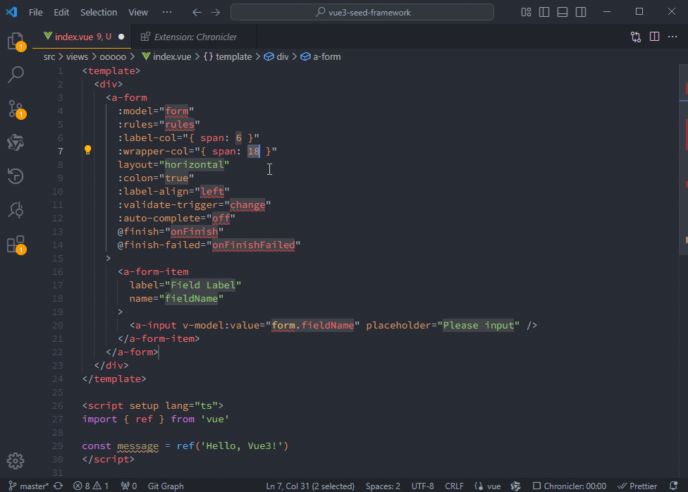

# Ant Design Vue 代码片段生成器

## 配置

创建 .env 文件，配置如下：

```
# Development
DEV_API_ENDPOINT=http://{host}/v1/chat/completions
DEV_MODEL=gpt-3.5-turbo

# Production
OPENAI_API_ENDPOINT=your_production_endpoint
OPENAI_MODEL=gpt-3.5-turbo
OPENAI_API_KEY=your_api_key
```

## 使用

1. 拷贝 `./dist/antd-vue.code-snippets` 到 `~/.vscode/` 目录下
2. VSCode 输入 `abutton` 即可自动提示

## 示例


